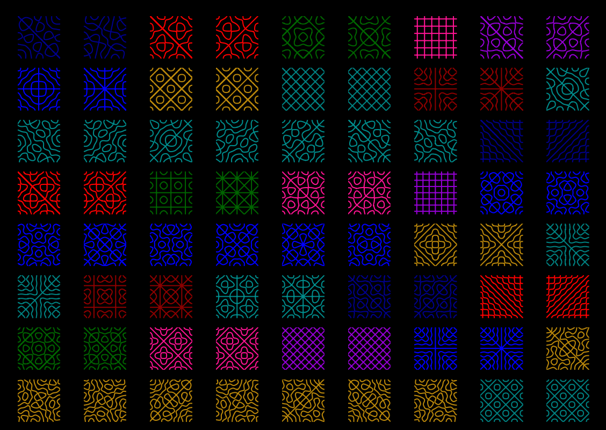

# Chladni Pattern Generator
Generating patterns made by particles on a vibrating plate, also known as Chladni patterns, using square and polar wave equation models. A project for Physics 4C under the Department of Physics and Engineering. Link to the report here: <a href = 'https://don-le.vercel.app/Chladni_Plate.pdf' target="_blank"> Chladni_Report </a> (or you can just view the pdf in the docs directory).

#### Python and Packages Information:
* Python 3.13.1
* Numpy 2.2.0
* Matplotlib 3.10.0
* Scipy 1.15.2
* Itertools

#### Main Project Files
* [The Cartesian Model](square_wave_equation.py)
* [The Polar Model](polar_wave_equation.py)
* [Plotting Specified Indexes for the Square Plate](specified_indexes.py)

## Preview

## Advanced Wave Mechanics: A Brief Overview

### The Wave Equation On Cartesian Coordinates
The multi-dimensional wave equation on $\Omega  = \\{(x,y)\in\mathbb{R}^2 | -a\leq x,y\leq a\\}$,

$$\frac{\partial^2u}{\partial t^2} = c^2\left(\frac{\partial^2u}{\partial x^2}  + \frac{\partial^2u}{\partial y^2} \right) + Q(x, y, t),\quad\quad \mathbf{x}\in\Omega$$

or written more compactly as

$$u_{tt} = c^2\nabla^2u + Q,\quad \mathbf{x}\in\Omega $$

can be used in certain cases to approximate Chladni patterns using the clamped boundary-initial conditions 

$$u_x(\pm a, y, t) = u_y(x, \pm a, t) = 0, \quad u(x,y,0) = f(x,y), \quad u_t(x,y,0) = g(x,y).$$

The solution to this equation can be expressed as a double Fourier Series,

$$u(x,y,t) = \frac{1}{4}A_{00} + \sum_{n=1}^{\infty}\sum_{m=1}^{\infty}X_n(x)Y_n(y)W_{nm}(t),$$

where

$$
\begin{align}
    X_n(x) &= a_n\cos\left(\frac{n\pi x}{L}\right) + \overline{a_n}\sin\left(\frac{n\pi x}{L}\right),\\
    Y_m(y) &= a_m\cos\left(\frac{m\pi y}{L}\right) + \overline{a_m}\sin\left(\frac{m\pi y}{L}\right),\\
    T_{nm}(t) &= A_{nm}\cos(\omega t) + B_{nm}\sin(\omega t) + \int_{0}^{t}q_{nm}(\tau)\frac{\sin(\omega t-\omega\tau)}{\omega}d\tau,\\
    \omega &= \frac{\pi}{L}c\sqrt{n^2+m^2}.
\end{align}
$$

and,

$$
\begin{alignat}{2}
    A_{nm} &= \frac{4}{L^2}\int_{-L/2}^{L/2}\int_{-L/2}^{L/2} f(x, y)X_n(x)Y_m(y)\;dxdy,\quad && n, m= 0, 1, 2,\ldots\\
    B_{nm} &= \frac{4}{L^2} \int_{-L/2}^{L/2}\int_{-L/2}^{L/2} \frac{g(x, y)}{\omega}X_n(x)Y_m(y)\;dxdy,\quad && n, m= 1, 2, 3\ldots
\end{alignat}
$$

Here, $q_{nm}$ is a function defined on the disk of radius $r$ — the radius of the tip of the wave generator,

$$q_{nm}(\tau)=\frac{4\alpha}{L^2} \cos(\omega_0 \tau) \iint_{U(r)}X_n(x)Y_m(y)\;dx dy,$$

where $U(r)=\\{(x,y)\in \mathbb{R}^2\;|\; x^2+y^2\leq r^2\\}$.

> [!NOTE]
> For more details on how these solutions are obtained, please spend some time to read the <a href = 'https://don-le.vercel.app/Chladni_Plate.pdf' target="_blank">project report</a>.

### The Wave Equation On Polar Coordinates

Similarly for the wave equation on polar coordinates, 

$$u_{tt} = c^2\left( u_{rr} + \frac{1}{r}u_r + \frac{1}{r^2}u_{\theta\theta}\right) + Q, \quad (r,\theta)\in\Omega,$$

the solution for the equation in this case is

$$u(r,\theta, t) = \sum_{n=0}^{\infty}\sum_{m=0}^{\infty}J_n\left( kr\right)[\Psi_{nm}(\theta)y_1(t) + \Phi_{nm}(\theta)y_2(t)],$$

where

$$
\begin{aligned}
    \Psi_{nm}(\theta) &= a_{nm}\cos(n\theta) + b_{nm}\sin(n\theta),\\
    \Phi_{nm}(\theta) &= c_{nm}\cos(n\theta) + d_{nm}\sin(n\theta),\\
    y_1(t) &= \alpha\cos(\omega t) + \beta\sin(\omega t) + \int_{0}^{t}p_{nm}(\tau)\frac{\sin(\omega(t-\tau))}{\omega}d\tau,\\
    y_2(t) &= \gamma\cos(\omega t) + \sigma\sin(\omega t) +  \int_{0}^{t}q_{nm}(\tau)\frac{\sin(\omega(t-\tau))}{\omega}d\tau,\\
    \omega &= \frac{cz_{nm}}{a} = ck.
\end{aligned}
$$
 
Here, $z_{nm}$ are the zeros of the m-th derivative of the n-th order Bessel function $J_n(x)$. $\alpha, \beta, \gamma, \sigma$ are arbitrary constants that satisfies $\alpha + \gamma = 1,$ $\beta + \sigma = 1$, where $\alpha^2 + \gamma^2 \neq 0$, $\beta^2 + \sigma^2 \neq 0$, and,

$$
\begin{align}
a_{nm} &= \frac{\langle J_0\cos(n\theta), f \rangle_w}{\langle J_0, J_0 \rangle_w} = \frac{\int_{0}^{a}\int_{0}^{2\pi}J_n\left( kr\right)\cos(n\theta) f(r,\theta)r\;drd\theta}{2\pi\int_{0}^{a}J_n^2\left( kr\right) rdr},\quad n, m = 0, 1, \ldots\\
b_{nm} &= \frac{\langle J_0\sin(n\theta), f \rangle_w}{\langle J_0, J_0 \rangle_w} = \frac{\int_{0}^{a}\int_{0}^{2\pi}J_n\left( kr\right)\sin(n\theta) f(r,\theta)r\;drd\theta}{2\pi\int_{0}^{a}J_n^2\left( kr\right) rdr},\quad n, m = 0, 1, \ldots\\
c_{nm} &= \frac{\langle J_0\cos(n\theta), g \rangle_w}{\omega\langle J_0, J_0 \rangle_w} = \frac{\int_{0}^{a}\int_{0}^{2\pi}J_n\left( kr\right)\cos(n\theta) g(r,\theta)r\;drd\theta}{2\pi\omega\int_{0}^{a}J_n^2\left( kr\right) rdr},\quad n, m = 0, 1, \ldots\\
d_{nm} &= \frac{\langle J_0\sin(n\theta), g \rangle_w}{\omega\langle J_0, J_0 \rangle_w} = \frac{\int_{0}^{a}\int_{0}^{2\pi}J_n\left( kr\right)\sin(n\theta) g(r,\theta)r\;drd\theta}{2\pi\omega\int_{0}^{a}J_n^2\left( kr\right) rdr},\quad n, m = 0, 1, \ldots
\end{align}
$$

> [!NOTE]
> All derivations above is only an approximation of the true model. The actual equation that governs the behavior of Chladni patterns is something called the Biharmonic Wave Equation, written fully as
> 
> $$\rho h\frac{\partial^2w}{\partial t^2} = - D\nabla^4 w + T\nabla^2 w -K_0w -K_1\frac{\partial w}{\partial t} + T_1\nabla^2\frac{\partial w}{\partial t} + F(\textbf{x}, t),$$ 
> 
> Here, $p$ is the density, $K_0$ is the linear stiffness coefficient, representing the linear storing force, $T$ is the tension coefficient, $K_1$ is the linear damping term, $T_1$ is the visco-elastic damping coefficient, $F(\mathbf{x}, t)$ is the forcing function, and $D$ is defined as 
> 
> $$D = \frac{Eh^3}{12(1-\nu^2)},$$
> 
> which includes the flexural rigidity constant $\nu$, $E$ is young's modulus, and $h$ is the thickness of the plate.
> 
> Read more about this topic in this [paper](https://arxiv.org/abs/2008.01693).